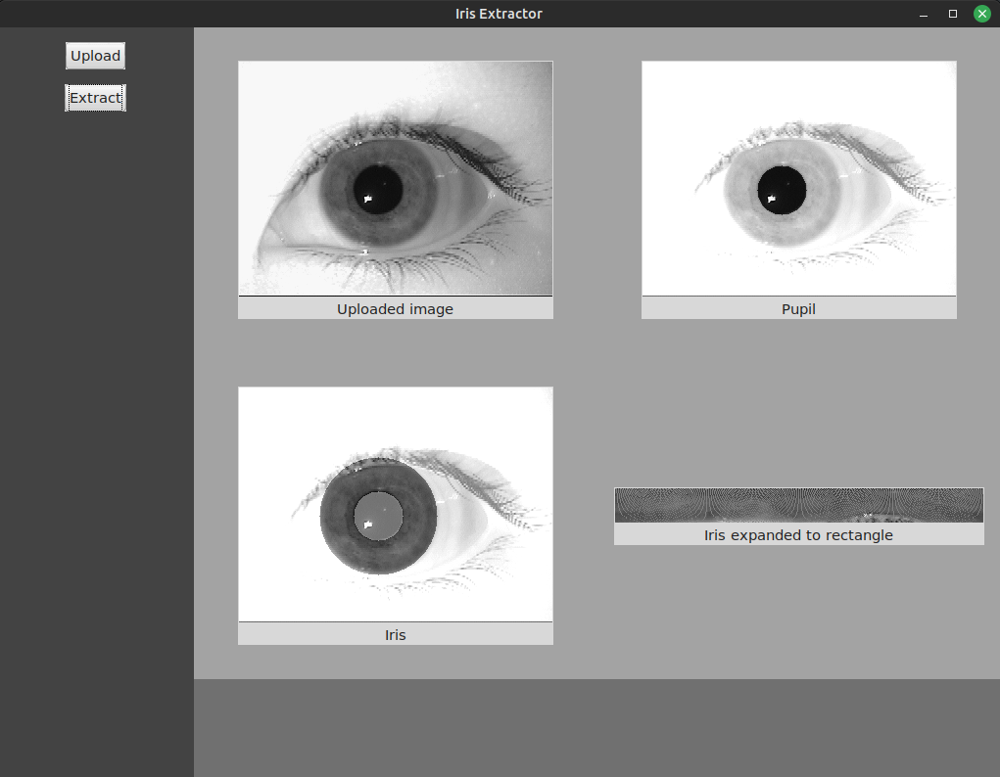

# Iris Detection App

A Python-based application for detecting and analyzing the iris region in eye images. The app processes images to locate the pupil and iris using morphology operations.

---

## Description

Application allow to upload grayscale eye image in .bmp format and extract iris from it. User is displayed with found pupil and iris regions and with iris expanded to rectangular form. In the future there will be an option to compare irises of two eyes to check whether they are the same one.

---

## Technologies Used

- Python 3.x
- Tkinter
- OpenCV
- NumPy

---

## Getting Started

### 1. Clone the repository:
```bash
git clone https://github.com/vecel/iris-detection.git
cd iris-detection
```

### 2. Install dependencies:
```bash
pip install -r requirements.txt
```

### 3. Download sample data:
```bash
python3 script.py
```

### 3. Run the app
```bash
python3 main.py
```

---

## Screenshots

